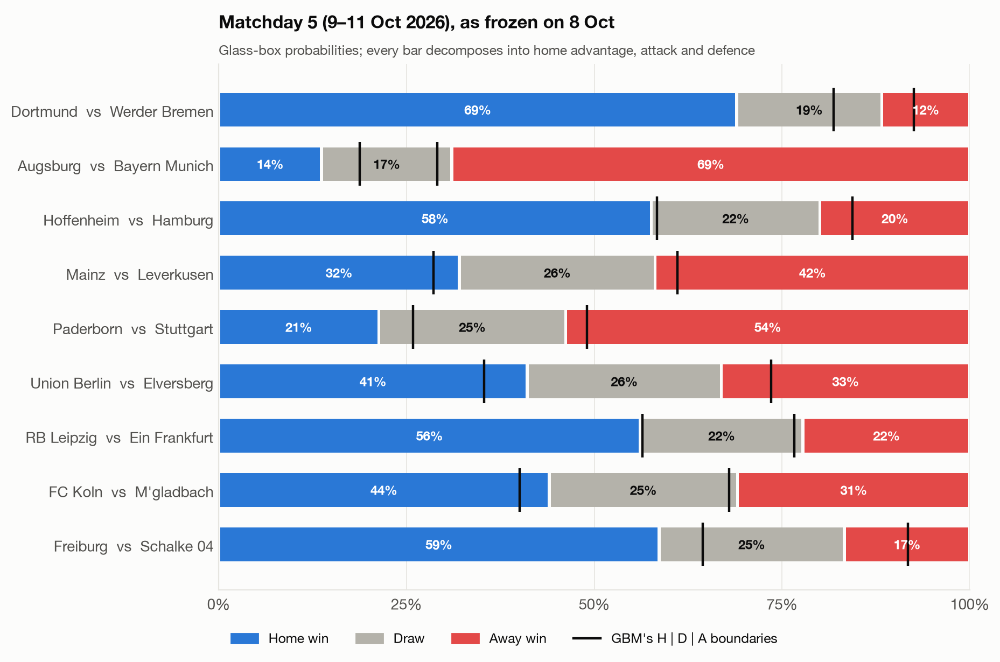
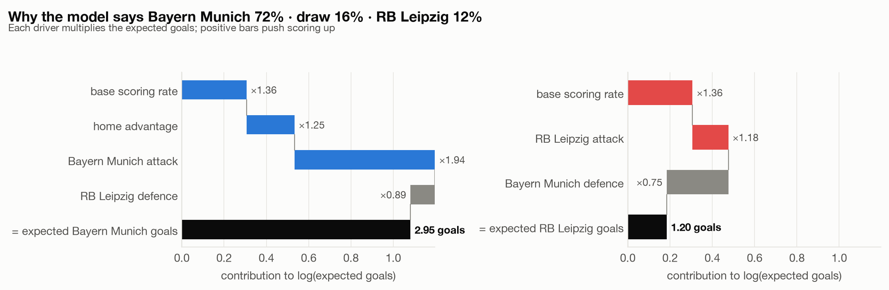
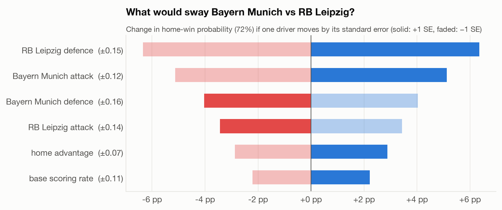
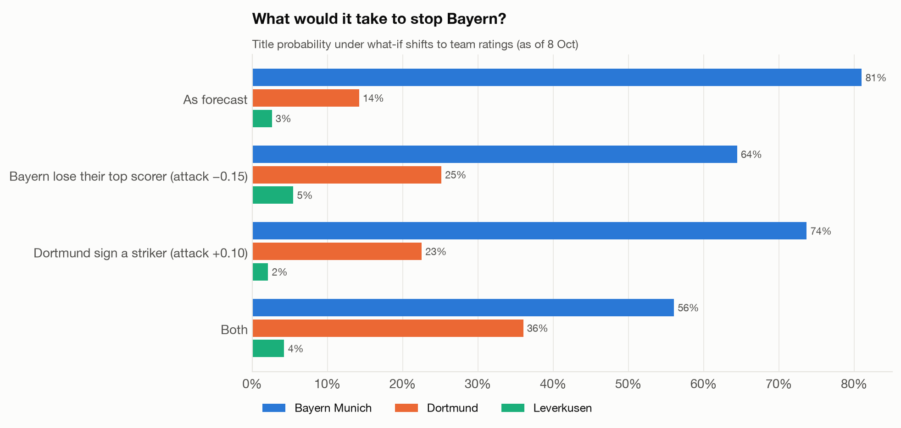
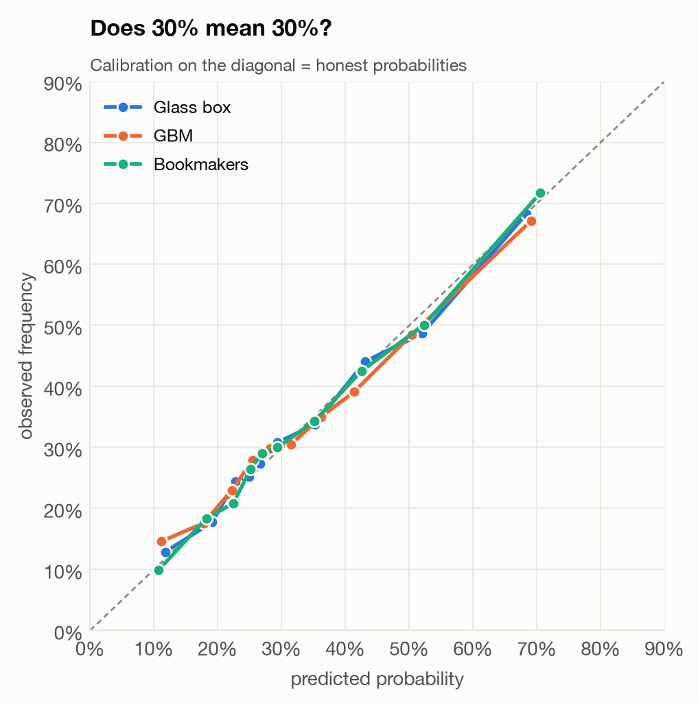
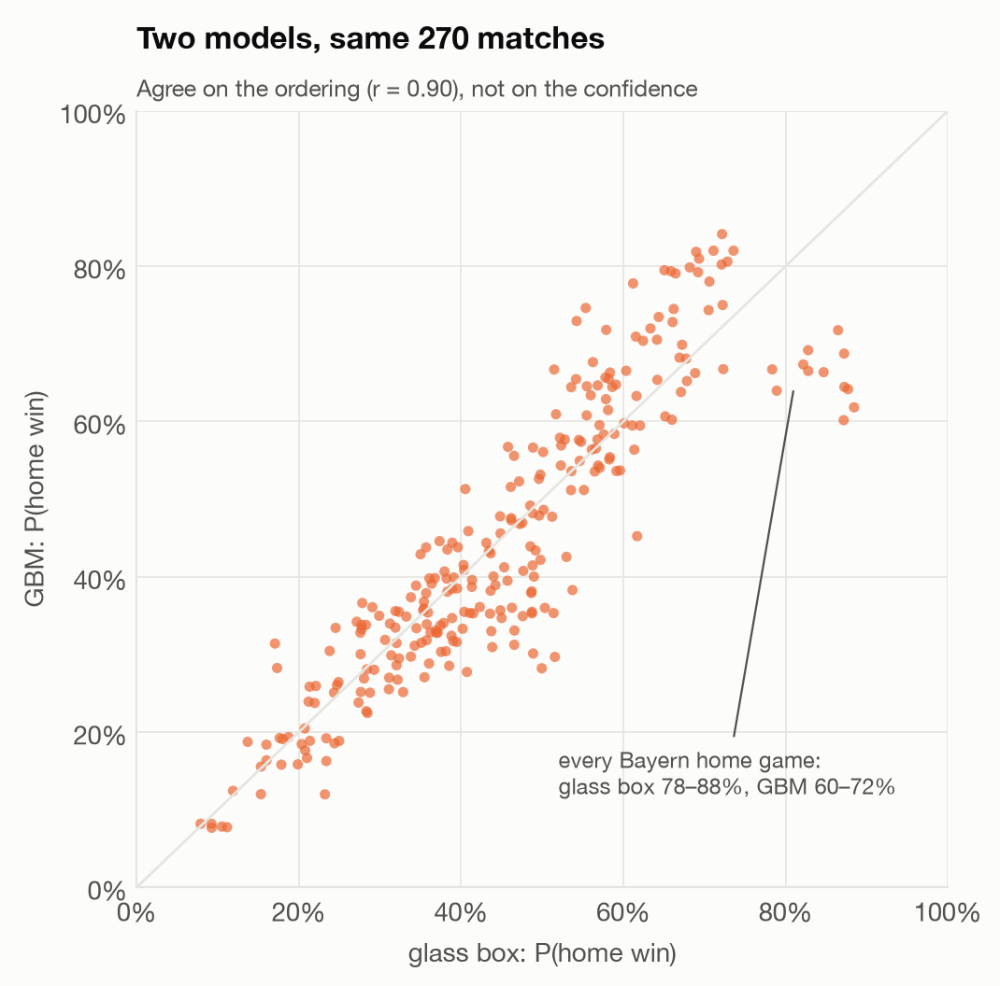
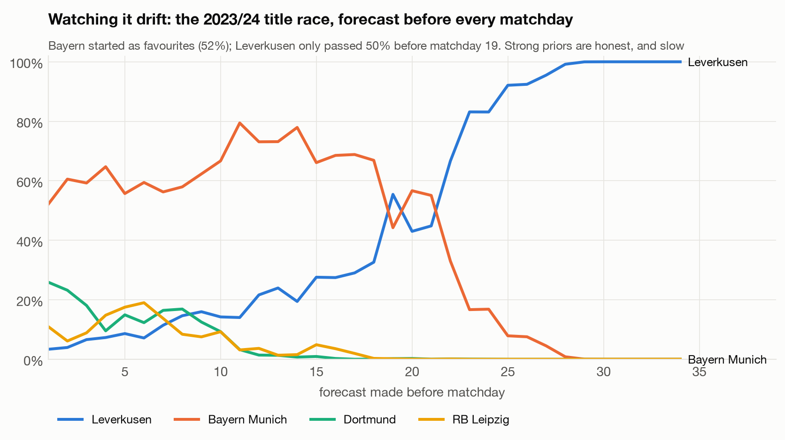
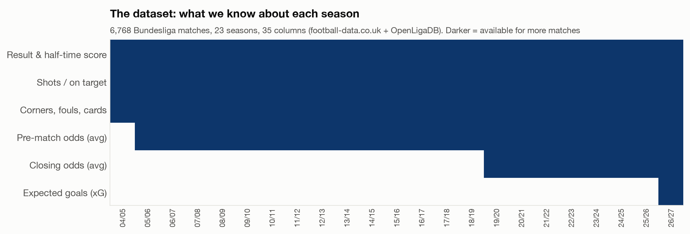

# glassball ⚽🔍

**Bundesliga predictions you can audit.** Forecast any matchday or the final table of any Bundesliga season since 2004/05, past, present or future, with a model whose every probability traces back to the handful of numbers that produced it.

```bash
pip install git+https://github.com/arijoury/glassball-bundesliga-predictions
```

```python
from glassball import Bundesliga

Bundesliga(2026).predict()                         # next matchday, with the drivers of every probability
Bundesliga(2026).forecast().table                  # simulated final table
Bundesliga(2023).forecast(before_matchday=10)      # any season, from any point in time
```

Data is downloaded from two free public sources and cached locally. No API keys, no accounts.

Companion code to the talk *Soccer Analytics: Traceable and Honest Forecasting Across a Bundesliga Season* (Machine Learning Week Europe, Munich, 17 Nov 2026) and to the book [*Soccer Analytics with Machine Learning*](https://learning.oreilly.com/library/view/soccer-analytics-with/9781098181109/) (O'Reilly, 2026). The model is also being tested live: a [pre-registered forecast for 2026/27](#live-test-a-pre-registered-forecast-for-202627) was frozen before matchday 5 and is graded in public.

---

## Every forecast comes with a receipt

The model is deliberately simple. Expected goals for each side are a product of a few named factors:

```
E[home goals] = exp( base + home advantage + attack[home] + defence[away] )
E[away goals] = exp( base                  + attack[away] + defence[home] )
```

Score probabilities follow from a Poisson distribution with a [Dixon-Coles](https://doi.org/10.1111/1467-9876.00065) correction for low scores. Ratings are fitted on time-weighted results (270-day half-life) and shrunk toward a prior, so newly promoted teams start cautious. So for any match you can ask *why*:

```python
s = Bundesliga(2026)
s.predict(5, contrast=True)                # a whole matchday, alongside a gradient-boosted contrast model
s.explain("Bayern Munich", "RB Leipzig")   # the receipt for one match
```





Bayern's attack nearly doubles their expected goals (×1.94), and that's most of the story. Leipzig's defence trims it a little (×0.89).

### What would sway it?

Every rating comes with a standard error, so you can ask how fragile a forecast is. If Leipzig's defence turned out one standard error better than estimated, Bayern's win probability would drop by about 6 percentage points:



### Which matches decide the season?

The table forecast comes from 20,000 simulated seasons, and each one also draws the team ratings from their uncertainty, not just the match outcomes. So you can condition on any single result. Dortmund's title chances were 14% after matchday 4. That becomes **29% if they win in Munich on matchday 8**, and 9% if they lose:

```python
fc = s.forecast()
fc.table                              # expected points, P(title / top 4 / relegation), full position distribution
fc.swing("Dortmund", "title")         # or "top4", "top6", "playoff16", "relegated"
```


### What-ifs

Injuries and transfers aren't in the data, but you can play them through as shifts to a team's ratings:

```python
s.forecast(shift={"Bayern Munich": {"attack": -0.15}})   # roughly: lose a top scorer
```



---

## Is it any good? Graded honestly

`s.evaluate()` replays a season matchday by matchday, predicting each one with data from before it only, and scores it against a gradient-boosted model (Elo + form features) and the betting market. The market is the benchmark that matters: closing odds aggregate everything the public knows, team news included.


- **The market wins, every season.** That's expected, and it's what makes this an honest yardstick rather than a straw man.
- **The glass box beats the gradient-boosted model in 6 of 7 seasons** (ranked probability score 0.2037 vs 0.2072 overall; market 0.1977).
- **The GBM's ranking depends on how you retrain it.** Retrained before every matchday (above), it loses 2025/26. Trained once at season start (see the [pre-registration](preregistration/2026-27/PREREGISTRATION.md)), it *wins* 2025/26. Judge a model on one season and you can pick either.



All three are well calibrated: when they say 30%, it happens about 30% of the time. The market's edge is *sharpness*. It's confident more often, and right when it is.

The two models agree on which team is better. They disagree on how sure to be. The biggest disagreement is every Bayern home game: the glass box says 78–88%, while the GBM, whose trees can't extrapolate past what they've seen, says 60–72%.



### Watching it drift

Honest models update slowly. Here is the model replaying Leverkusen's unbeaten 2023/24 season, re-forecasting before every matchday:

```python
s = Bundesliga(2023)
{md: s.forecast(before_matchday=md).table.p_title for md in range(1, 35)}
```



---

## The data

Two free public sources, reconciled automatically. Team names differ between them and across seasons, so they're matched on (date, score).

- [football-data.co.uk](https://www.football-data.co.uk): results, shots, cards and bookmaker odds since the 1990s (xG from 2026/27)
- [OpenLigaDB](https://www.openligadb.de): official matchday structure and future fixtures




Over 16 seasons of refitted ratings, Bayern's dominance, Dortmund's peak years, RB Leipzig's arrival (and the promoted-team prior they had to climb out of) and Leverkusen's 2024 surge are all visible:


---

## Package reference

```python
from glassball import Bundesliga, plots

s = Bundesliga(2026)              # the season starting in 2026; data is cached in ~/.cache/glassball
s.fixtures                        # all 306 matches: matchday, kickoff, result, shots, odds (where played)
s.table(after_matchday=4)         # league table at any point
s.ratings(before_matchday=5)      # attack / defence ratings with standard errors
s.predict(5, contrast=True)       # H/D/A, expected goals, drivers (+ GBM; + bookmakers and result if played)
s.explain("Dortmund", "Werder Bremen")
fc = s.forecast(before_matchday=5, n_sims=20_000)
fc.table                          # expected points/position, event probabilities, position distribution
fc.swing("Union Berlin", "relegated")
s.evaluate()                      # walk-forward grading of every played matchday

plots.matchday(s.predict(contrast=True))
plots.table(fc)
plots.explain(s.explain("Bayern Munich", "RB Leipzig"))
plots.swing(fc.swing("Dortmund", "title"))
```

**Time travel is built in.** Every method takes `before_matchday=` or `as_of=`, and forecasts only ever use matches played before that point. So any historical forecast is a genuine out-of-sample forecast. Seasons from 2004/05 onwards are supported, and future seasons work as soon as OpenLigaDB publishes their fixtures. Hyperparameters live in `glassball.Hyper` if you want to experiment: `Bundesliga(2026, hyper=Hyper(half_life_days=180))`.

### Limitations

- No lineups, injuries or transfers. They only reach the model through results, with a lag.
- Ratings are fixed within a forecast. A match in March is forecast with October's ratings, and only parameter uncertainty widens it.
- Promoted teams start from a generic prior, so their ratings are the least certain.
- Goals are noisy. xG-based ratings would likely be sharper, but public Bundesliga xG only starts in 2026/27.

---

## Live test: a pre-registered forecast for 2026/27

Backtests can be tuned until they look good, so this model is also being tested in the open. On **8 October 2026**, after matchday 4 and before matchday 5 kicked off, I froze its prediction for all 270 remaining matches and the final table, and fixed in advance how it would be graded.

| | |
|---|---|
| **Headline** | Bayern 81% to win the title, Dortmund 14%, Leverkusen 3%. Relegation: Paderborn 37%, Union 33%, Schalke 31%, Hamburg 28% |
| **Fingerprint** | `e9753a97bafee5a04ce2c9229f843ed216f3e2459d97cd33a45006028530cf1a` (SHA-256 of the manifest of every frozen file) |
| **Verify** | `./scripts/verify_freeze.sh` |
| **Everything** | [`preregistration/2026-27/`](preregistration/2026-27/): rules, frozen code, data snapshot, forecasts, and rolling updates after each matchday |

The frozen folder is self-contained and never edited. The package is tested to reproduce it exactly from its data snapshot (`tests/test_reproduces_freeze.py`). First public grading: Machine Learning Week Europe, Munich, 17 November 2026, after matchdays 5–9.

## Repository layout

```
glassball/                  the package
tests/                      incl. a check that the package reproduces the frozen forecast
scripts/make_figures.py     regenerates every figure in this README
scripts/verify_freeze.sh    checks the frozen forecast against its published fingerprint
figures/                    the figures above (and their cached inputs in figures/data/)
preregistration/2026-27/    the live test: frozen, self-contained, graded in public
```

MIT licensed.

---

Built by [Ari Joury](https://www.linkedin.com/in/arijoury) at [Wangari Global](https://wangari.global), where we build reliable, traceable AI and analytics. In football, that discipline keeps a forecast honest; in production, it keeps a model trustworthy.
