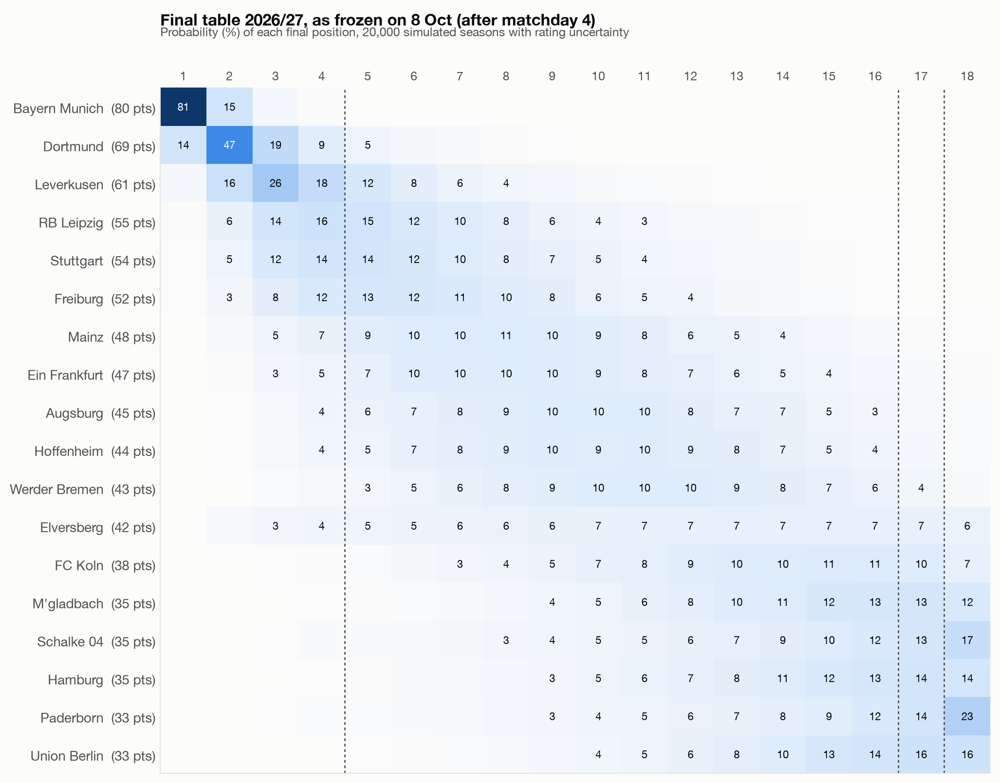
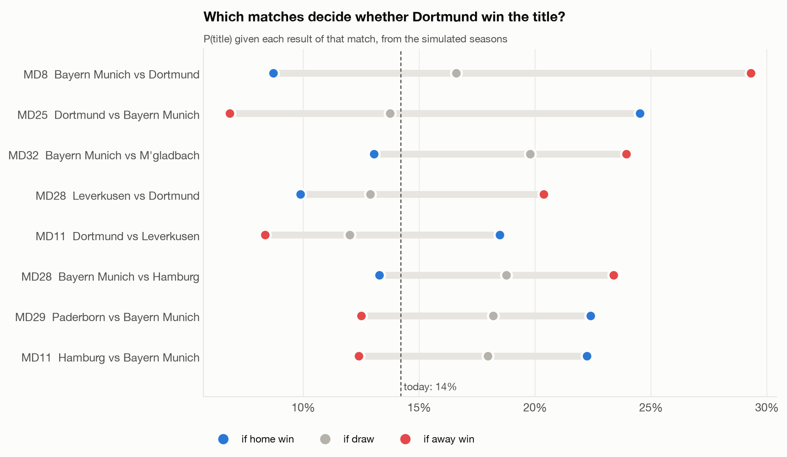
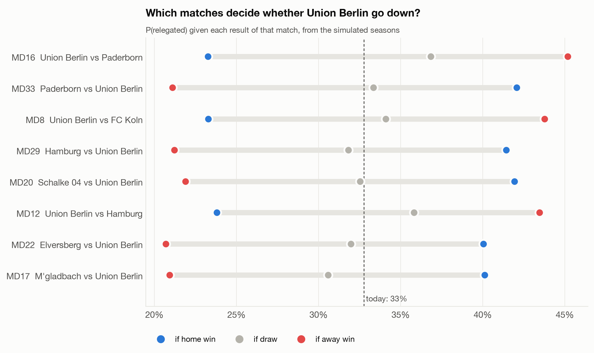
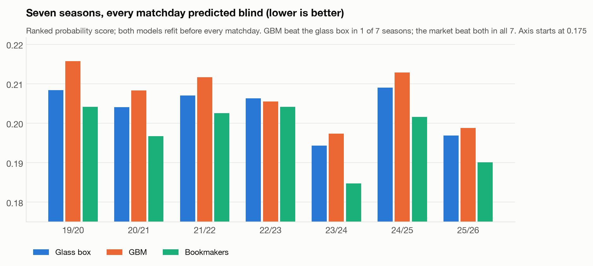
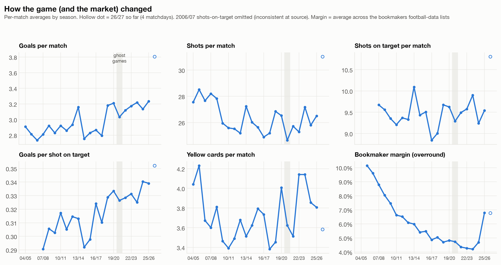
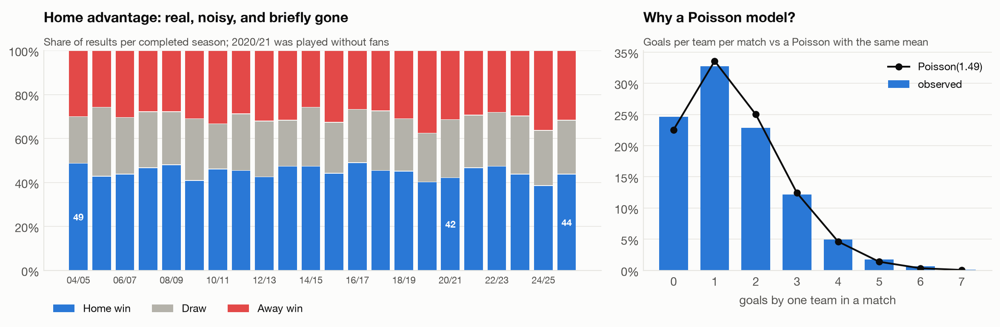
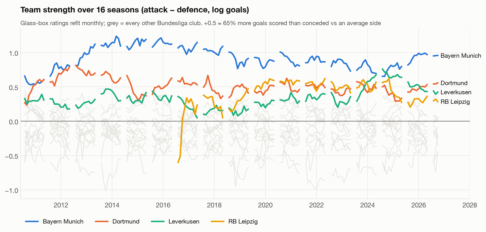

# Bundesliga 2026/27: the frozen forecast, results as of 8 October 2026

*Snapshot written 8 October 2026, after matchday 4, before matchday 5. Everything here comes from the frozen files in this folder. Later updates will be added as separate, dated files; this one won't be edited.*

| | |
|---|---|
| **Frozen** | 8 Oct 2026, before Dortmund vs Werder Bremen (Fri 9 Oct, 20:30 CEST) |
| **Fingerprint** | `e9753a97bafee5a04ce2c9229f843ed216f3e2459d97cd33a45006028530cf1a` (SHA-256 of [`MANIFEST.sha256`](MANIFEST.sha256)) |
| **Verify** | `./verify.sh` |
| **Rules** | [PREREGISTRATION.md](PREREGISTRATION.md): metrics, benchmarks, update protocol |
| **Raw forecasts** | [`freeze/2026-10-08/`](freeze/2026-10-08/) |
| **First grading** | Machine Learning Week Europe, Munich, 17 Nov 2026 (matchdays 5–9) |

## Headline

- **Title:** Bayern 81%, Dortmund 14%, Leverkusen 3%.
- **Relegation (17th–18th):** Paderborn 37%, Union Berlin 33%, Schalke 31%, Hamburg 28%, Gladbach 25%.
- **Expected final points:** Bayern 80, Dortmund 69, Leverkusen 61.

The black ticks mark the contrast model's (gradient-boosted classifier) home | draw | away boundaries. Both models' forecasts are frozen, and both get graded.

## What drives the forecasts

Bayern vs RB Leipzig (matchday 6): Bayern's attack nearly doubles their expected goals (×1.94), and that's most of the story.

## Which matches decide the season

Dortmund's title chances: 14% overall, **29% if they win in Munich on matchday 8**, 9% if they lose.

## Glass box vs gradient boosting

The two models agree on which team is better (r = 0.90) but not on how sure to be. The biggest gap is every Bayern home game: the glass box says 78–88%, the GBM 60–72%. Trees can't extrapolate past what they've seen. This season will show who's right.

**Reproducibility.** Re-running the freeze under an older stack (Python 3.10, scikit-learn 1.7.2 instead of 1.9.1) reproduces the glass box to the 4th decimal. The GBM's matchday-5 probabilities move by up to 5.3 percentage points (1.6 on average). Same data, same code, same seed, different library version. The frozen versions are pinned in [`requirements.txt`](requirements.txt) and [`freeze/2026-10-08/meta.json`](freeze/2026-10-08/meta.json).

## Track record before the freeze

Walk-forward over 2019/20–2025/26, with both models refit before every matchday and graded on the ranked probability score (lower is better):

| | RPS, 7 seasons |
|---|---|
| Glass box (Dixon-Coles) | 0.2037 |
| GBM (Elo + form) | 0.2072 |
| Bookmakers (avg. closing odds) | **0.1977** |

- **The market beats both models in every season.**
- **The glass box beats the GBM in 6 of 7 seasons.** Caveat: hyperparameters were tuned on 2019/20–2024/25, which slightly favours the glass box on those seasons.
- **The GBM's ranking flips with its retraining schedule.** Trained once at season start, it *won* the held-out 2025/26 season (0.1949 vs 0.1970; see [PREREGISTRATION.md](PREREGISTRATION.md)). Retrained every matchday, it lost it (0.1988 vs 0.1969).
- **All three are well calibrated.** The market's edge is sharpness, not honesty.

### Drift: how fast should a model change its mind?

Replaying 2023/24, Leverkusen's unbeaten season: Bayern started as favourites, and Leverkusen only passed 50% before matchday 19.

## The data behind it

---

Regenerate all figures with `python preregistration/2026-27/analysis/make_figures.py`. Forecast figures are drawn from the frozen files, not from a re-fit.
